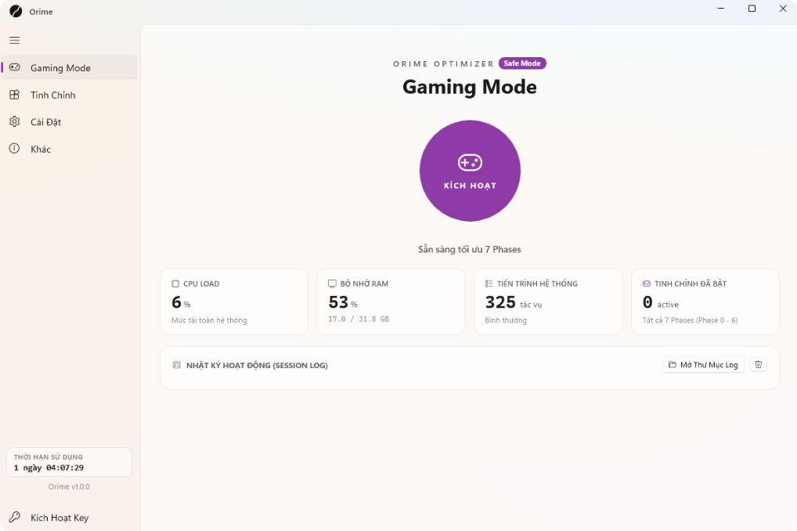
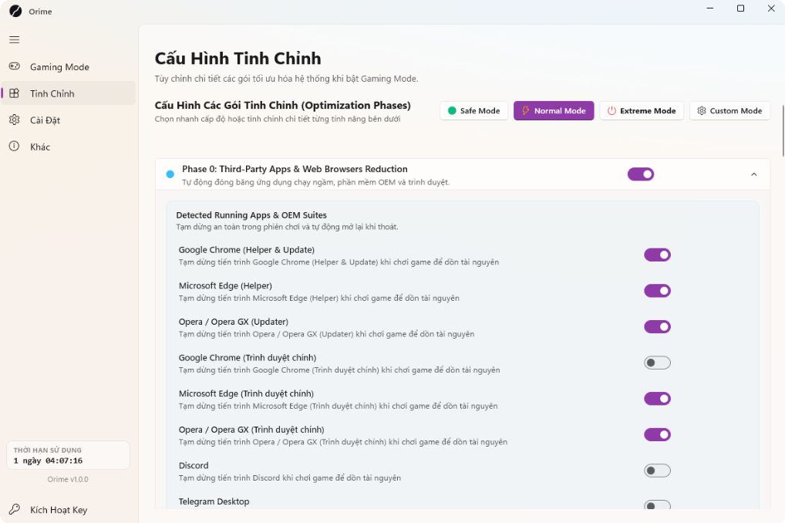

<div align="center">

# Orime Optimizer

**Reversible Windows game optimizer built with WinUI 3 and .NET 10.**

[-0078D4?style=flat-square&logo=windows)](https://github.com/Nahvine/Orime-Release)
[](https://github.com/Nahvine/Orime-Release)
[](https://github.com/Nahvine/Orime-Release)

[Website](https://orime.osteup.io.vn) | [Bản Tiếng Việt](README_VIETNAMESE.md) | [Releases](https://github.com/Nahvine/Orime-Release/releases)

<br/>



</div>

---

## Overview

Orime optimizes Windows 10 and 11 for lower input latency and smoother frame delivery during games.

Unlike static tweak scripts that make permanent registry edits, Orime saves a snapshot of your original system settings (services, power plans, and registry keys) into a local journal before making changes. When you turn off Gaming Mode or close the app, it restores those settings to their previous state.

The application is written in C# on .NET 10 with a native WinUI 3 interface.

<div align="center">

</div>

---

## How Gaming Mode Works

When activated, Orime applies tweaks across seven sequential phases:

| Phase | Target | Action |
| :--- | :--- | :--- |
| **Phase 0** | **Background helpers** | Suspends non-critical helper processes (such as browser update checkers and peripheral software agents) to reduce background CPU usage without closing your open tabs. |
| **Phase 1** | **Telemetry and background services** | Pauses diagnostic tracing, telemetry collection, and the print spooler while gaming. |
| **Phase 2** | **RAM and background maintenance** | Purges standby memory cache and pauses scheduled Windows maintenance tasks. |
| **Phase 3** | **Network latency** | Pings Cloudflare (`1.1.1.1`), Google (`8.8.8.8`), and Quad9 to find the lowest-latency DNS resolver. Enables `TCP NoDelay`. |
| **Phase 4** | **Explorer shell (optional)** | Can suspend `explorer.exe` during full-screen gameplay to free 200 to 400 MB of RAM and reduce DWM compositor overhead. Restores Explorer automatically when you exit. |
| **Phase 5** | **Antivirus scan priority** | Lowers Windows Defender scan priority during active sessions to prevent sudden disk spikes. |
| **Phase 6** | **CPU and timer resolution** | Unparks CPU cores, activates the Ultimate Performance power scheme, and sets the system timer resolution to 0.5 ms. |

---

## Presets

* **Safe Mode**: Suspends background updaters and applies power tweaks. Leaves web browsers, Discord, and Windows Search untouched.
* **Normal Mode**: Recommended for most games. Adds standby memory clearing, 0.5 ms timer resolution, and CPU core unparking.
* **Extreme Mode**: Intended for low-spec hardware or competitive play where reducing latency is the priority.

---

## Commands

### Install or Update

Open **PowerShell** and run:

```powershell
irm https://raw.githubusercontent.com/Nahvine/Orime-Release/main/install.ps1 | iex
```

Running this command on a system that already has Orime will close the running app, replace the application files with the latest build, and update desktop and Start menu shortcuts. Your saved configuration and license key are stored separately in `%LOCALAPPDATA%\Orime` and will stay intact.

### Uninstall

To remove Orime, its shortcuts, and associated data from your system:

```powershell
irm https://raw.githubusercontent.com/Nahvine/Orime-Release/main/uninstall.ps1 | iex
```

The script will:
1. Stop any running Orime processes.
2. Remove shortcuts from the Desktop and Start Menu.
3. Delete the install folder from `Program Files` or `AppData\Programs`.
4. Remove any registered MSIX package.
5. Clean up temporary files and user data in `%LOCALAPPDATA%\Orime`.

### Portable Build

If you prefer not to use the installer:

1. Download [Orime_v1.0_Portable_x64.zip](https://raw.githubusercontent.com/Nahvine/Orime-Release/main/download/Orime_v1.0_Portable_x64.zip) or grab it from [Releases](https://github.com/Nahvine/Orime-Release/releases).
2. Extract the archive.
3. Run `Orime.exe`.

---

## System Requirements

* Windows 10 (version 1903 or newer) or Windows 11 (64-bit).
* Administrator rights (required for adjusting the 0.5 ms kernel timer and Windows service states).
* The portable download includes the required .NET 10 runtime files.
